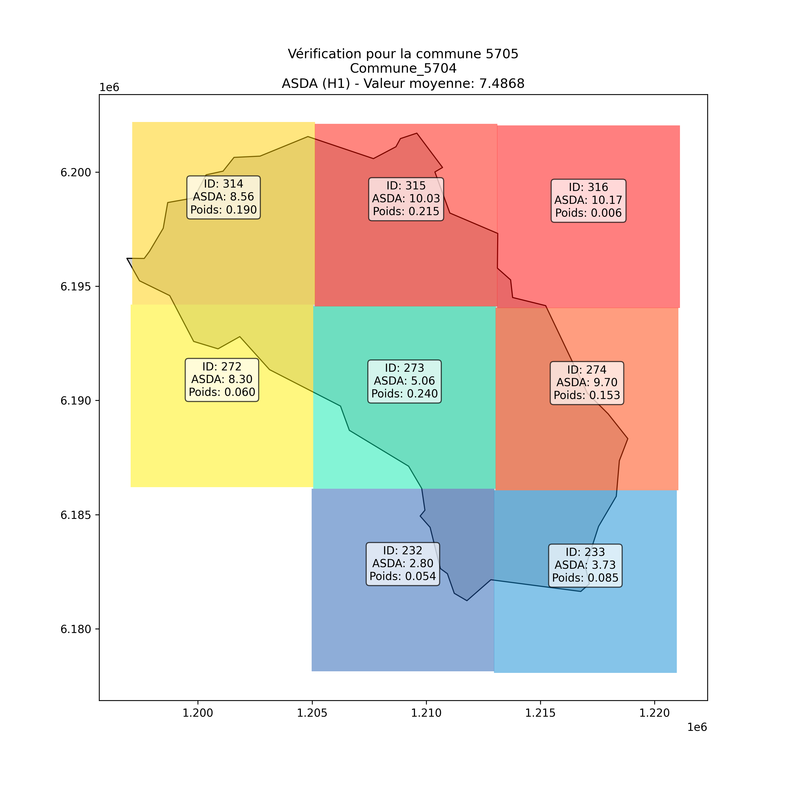

# GéoClimat : Mon application de visualisation climatique

Bienvenue sur **GéoClimat**, une application que j’ai développée pour visualiser les données climatiques issues de la plateforme **DRIAS**, à l’échelle **communale** et **départementale**.

## Données et traitement

Les données d'origine sont fournies sous forme de **grilles SAFRAN** (4000 m x 4000 m). Durant mon stage, j’ai effectué une **pondération par commune** en fonction de leur surface (voir capture d’écran). Ensuite, cette pondération a été adaptée **au niveau départemental**, afin de rendre les données exploitables dans l’application.

## Fonctionnalités principales

Dans **GéoClimat**, l’utilisateur peut :

-   Choisir un **indicateur climatique DRIAS**, parmi **4 thématiques** disponibles
-   Sélectionner un **scénario RCP**
-   Définir l’**horizon temporel** des données

Un onglet **"Explication des indicateurs"** présente en détail tous les indicateurs utilisés.

## Visualisation des résultats

-   Les résultats s'affichent sur une **carte interactive**
-   Il est possible de **cliquer sur une commune ou un département** pour obtenir des **informations détaillées** (commentaires dynamiques)
-   La **légende, le titre et l’horizon** s’adaptent automatiquement aux paramètres choisis
-   L’utilisateur peut :
    -   Télécharger la carte au format **PDF**
    -   Exporter les données au format **Excel**

## Diagnostic climatique localisé

Grâce à l’intégration de l’**API de la Base Adresse Nationale (BAN)**, une fonctionnalité permet d’obtenir un **diagnostic climatique spécifique** à une adresse saisie :

-   Trois indicateurs climatiques sont affichés
-   Ils sont **comparés à la moyenne nationale**
-   Le diagnostic est **consultable en ligne** et **téléchargeable au format PDF**

Les graphiques s’inspirent du site ClimaDiag de Météo-France :\
🔗 [ClimaDiag - Météo-France](https://meteofrance.com/climadiag-commune)

## Qualité de l’eau

Un onglet **"Qualité de l’eau"**, basé sur l’**API Hub’Eau**, permet de :

-   Consulter les données des **stations proches** d’un lieu sélectionné (commune, département, coordonnées ou cours d’eau)
-   Choisir un **polluant** et une **période**
-   Générer un **graphique** à partir des données
-   Afficher les résultats sous forme de **tableau**

> ⚠️ N’oubliez pas de cliquer sur "**Charger les données**" pour que les résultats s'affichent.

## Contact

Un onglet **"Contact"** vous permet de me joindre facilement pour toute question ou remarque.

## Notes importantes

-   📄 Un fichier de **documentation des deux API utilisées** est fourni au format Markdown.
-   ℹ️ Certaines cartes peuvent apparaître **incomplètes pour le scénario RCP 4.5** : ce n’est **pas un bug d’affichage**, mais un **problème de données incomplètes** côté DRIAS (l’organisme a été contacté à ce sujet).
